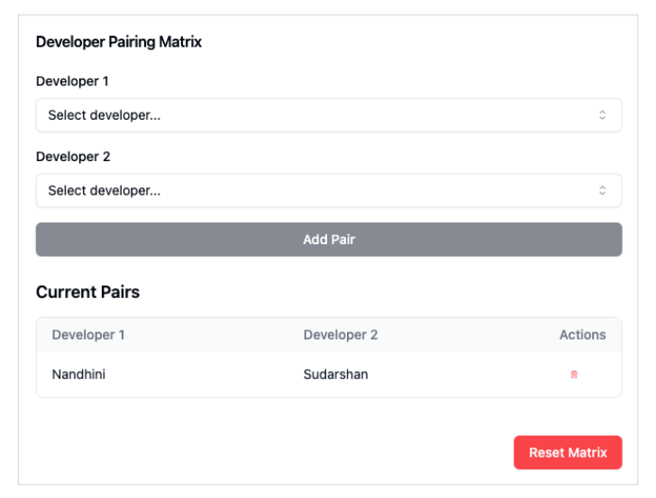
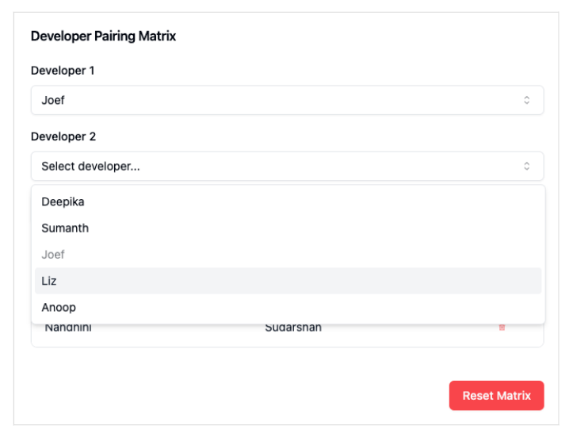

[Home](../../README.md)

# Pairing Matrix

As a team lead or scrum master, I want to create and manage developer pairs through a pairing matrix interface so that I can effectively organize and track pair programming assignments.

## Acceptance Criteria

### Developer Selection
- **Given** a master list of developers  
- **When** I open the pairing form  
- **Then** I should see two dropdowns labeled "Developer 1" and "Developer 2," each populated with all available developer names.  

### Selection Logic
- **Given** both dropdowns are populated with developer names  
- **When** I select a developer in the "Developer 1" dropdown  
- **Then** that developer should be disabled in the "Developer 2" dropdown.  
- **And** when I select a developer in the "Developer 2" dropdown  
- **Then** that developer should be disabled in the "Developer 1" dropdown.  

### Adding Pairs
- **Given** I have selected developers in both dropdowns  
- **When** I click the "Add Pair" button  
- **Then** the selected pair should be added to a "Current Pairs" table  
- **And** the selected developers should be removed from both dropdowns.  

### Current Pairs Display
- **Given** there are developer pairs in the "Current Pairs" table  
- **When** I view the dropdowns  
- **Then** only unpaired developers should appear as available options  
- **And** a table labeled "Current Pairs" should display all paired developers.  

### Reset Matrix
- **Given** there is at least one pair in the "Current Pairs" table  
- **Then** a "Reset Matrix" button should be visible  
- **When** I click the "Reset Matrix" button  
- **Then** an alert should ask, "Are you sure you want to reset the board?"  
- **And** if I confirm "Yes," all current pairs should be cleared  
- **And** all developers should return to the dropdowns.  

### Remove Individual Pairs
- **Given** there are pairs in the "Current Pairs" table  
- **When** I click the remove button for a specific pair  
- **Then** that pair should be removed from the "Current Pairs" table  
- **And** both developers should return to the dropdowns.
