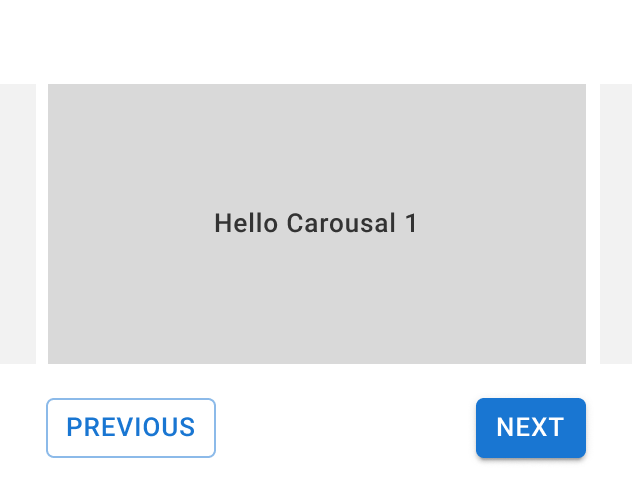

[Home](../../README.md)

# Carousel

Implement a carousel:
1. Clicking on next button should show the next item and should move to first item from last item
2. Clicking on previous button should show the previous item and should move to last item from first item
3. Auto switch the item after every 2 seconds
4. Keyboard arrow buttons should switch items


```
    <Carousel>
      <div>Hello Carousel 1</div>
      <div>Hello Carousel 2</div>
      <div>Hello Carousel 3</div>
    </Carousel>
```




