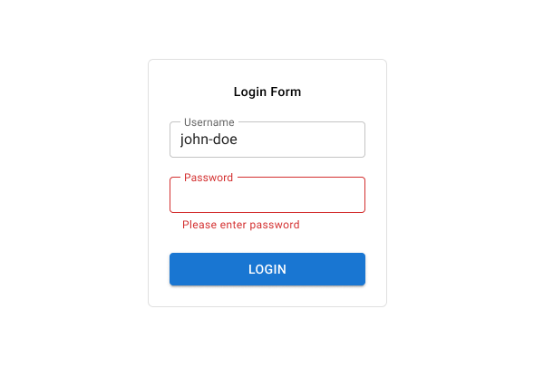

[Home](../../README.md)

# Login Form

Create a login form with following validations:
1. Username and password are required.
2. Password should be masked.
3. Password should be a minimum of 8 characters.
4. Password should have at least 1 special character and 1 number.
5. Validations should be triggered when the login button is clicked.

